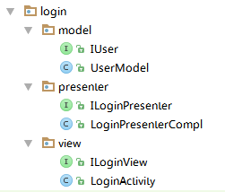

## 简单介绍

MVP(Model-View-Presenter)，MVC模式的演化版本。

### 优点：

> * 能有效降低View的复杂度，避免业务逻辑被塞进View中，使得View变成一个混乱的大泥坑。

> * MVP模式会解除View与Model的耦合，同时又带来了良好的可扩展性，可测试性，保证了系统的整洁性，灵活性。

缺点：

> * 对于简单应用来说MVP模式稍显麻烦，各种各样的接口与概念使得整个应用充斥着零散的接口。

对于复杂的应用来说，MVP模式是一种良好的结构模式，他能够非常好的组织应用结构，使得应用变得灵活，拥抱变化。

MVP可以分离显示层与逻辑层，他们之间通过接口进行通信，降低耦合度。理想的MVP模式可以实现同一份逻辑代码搭配不同的显示界面，因为他们之间并不依赖具体，而是依赖于抽象。这使得Presenter可以运用于任何实现了View逻辑接口的UI，使之具有更广泛的适用性，保证了灵活度。

在Android中业务逻辑跟数据存取是紧耦合的，很多工程师会将各种各样的业务逻辑塞进某个Activity,Fragment或者自定义的View类中，使得这些组件的单个类型显得臃肿不堪，其中又含有一些异步的任务，导致某个类超过千行代码。


对于一个可扩展，稳定的应用来说，我们需要定义分离各个层，主要是UI层，业务逻辑层和数据层，毕竟，我们不知道以后还要加入什么逻辑，是从本地数据库检索数据？还是从远程的服务中？我们的UI，数据库，是否会被替换？例如，随着产品升级，我们的UI可能会被重新设计，若UI发生了变化，此时由于业务逻辑耦合在View中，UI变化导致我们修改新的View控件，此时你就需要到原来的View中抽离出具体的业务逻辑，这将是一件非常折磨人的也易于出错的事情，到最终你还是需要将业务逻辑抽离出来。

MVP模式并不是一个标准化的模式，他有很多的实现方式，我们可以根据自己的需求跟自己认为对的方式去修正MVP的实现方式，他可以随着Presenter的复杂程度变化。只要保证我们是通过Presenter将View和Model解耦合，降低类型复杂度，各个模块可以独立测试，独立变化，这就是正确的方向。在Android开发中大多数人会把Activity，Fragmengt作为View角色来看待，因为他的职责是加载并且处理一些简单的与View相关的逻辑，他组织与管理View集合，我们可以把它看作粗粒度的View，当然你也可以把它看做Presenter。


## MVP模式的三个角色

> * Presenter 交互中间人
> * View      用户界面
> * Model     数据的存取

### Presenter——交互中间人

是沟通Model跟View的桥梁，他从Model层检索数据后，返回给View层，使得View跟Model之间没有耦合，也将业务逻辑从View角色上抽离出来。

### View——用户界面

View通常是指Activity，Fragment或者某个View控件，它含有一个Presenter成员变量。通常View需要实现一个逻辑接口，View上的操作通过接口转交给Presenter进行实现，最后，Presenter调用View逻辑接口将结果返回给View元素。

### Model——数据的存取

对于一个结构化的APP来说，Model角色主要是提供数据的存取功能。Presenter需要通过Model层存储，获取数据，Model就像是一个数据库。更直白的说，Model是封装了数据库DAO或者网络获取数据的角色，或者两种数据获取方式的集合。

## 跟MVC框架模式的区别：

MVC的特点：
> * 用户可以向View发送指令，再由View直接要求Model改变状态。
> * 用户也可以直接向Controler发送指令，再由Controler发送给View。
> * Controler起到事件路由器的作用，同时业务逻辑都部署在Controler中。

相较于MVP模式，MVC模式的耦合性还是比较高的，View可以直接访问Model，导致三者之间构成回路。因此，MVP与MVC的主要区别是，
> MVP中的View不能直接访问Model，需要通过Presenter发出请求，View跟Model不直接通信。

## MVP的简单示例：

![此处输入图片的描述][1]

一个简单的登录界面（实在想不到别的了╮(￣▽￣")╭），点击LOGIN则进行账号密码验证，点击CLEAR则重置输入。

][2]

项目结构看起来像是这个样子的，MVP的分层还是很清晰的。我的习惯是先按模块分Package，在模块下面再去创建model、view、presenter的子Package，当然也可以用model、view、presenter作为顶级的Package，然后把所有的模块的model、view、presenter类都到这三个顶级Package中，就好像有人喜欢把项目里所有的Activity、Fragment、Adapter都放在一起一样。

LoginActivity
```
public class LoginActivity extends ActionBarActivity implements ILoginView, View.OnClickListener {

    private EditText editUser;
    private EditText editPass;
    private Button   btnLogin;
    private Button   btnClear;
    ILoginPresenter loginPresenter;
    private ProgressBar progressBar;

    @Override
    protected void onCreate(Bundle savedInstanceState) {
        super.onCreate(savedInstanceState);
        setContentView(R.layout.activity_main);

        //find view
        editUser = (EditText) this.findViewById(R.id.et_login_username);
        editPass = (EditText) this.findViewById(R.id.et_login_password);
        btnLogin = (Button) this.findViewById(R.id.btn_login_login);
        btnClear = (Button) this.findViewById(R.id.btn_login_clear);
        progressBar = (ProgressBar) this.findViewById(R.id.progress_login);

        //set listener
        btnLogin.setOnClickListener(this);
        btnClear.setOnClickListener(this);

        //init
        loginPresenter = new LoginPresenterCompl(this);
        loginPresenter.setProgressBarVisiblity(View.INVISIBLE);
    }

    @Override
    public void onClick(View v) {
        switch (v.getId()){
            case R.id.btn_login_clear:
                loginPresenter.clear();
                break;
            case R.id.btn_login_login:
                loginPresenter.setProgressBarVisiblity(View.VISIBLE);
                btnLogin.setEnabled(false);
                btnClear.setEnabled(false);
                loginPresenter.doLogin(editUser.getText().toString(), editPass.getText().toString());
                break;
        }
    }

    @Override
    public void onClearText() {
        editUser.setText("");
        editPass.setText("");
    }

    @Override
    public void onLoginResult(Boolean result, int code) {
        loginPresenter.setProgressBarVisiblity(View.INVISIBLE);
        btnLogin.setEnabled(true);
        btnClear.setEnabled(true);
        if (result){
            Toast.makeText(this,"Login Success",Toast.LENGTH_SHORT).show();
            startActivity(new Intent(this, HomeActivity.class));
        }
        else
            Toast.makeText(this,"Login Fail, code = " + code,Toast.LENGTH_SHORT).show();
    }


    @Override
    public void onSetProgressBarVisibility(int visibility) {
        progressBar.setVisibility(visibility);
    }
}
```

从代码可以看出LoginActivity只做了findView以及setListener的工作，而且包含了一个ILoginPresenter，所有业务逻辑都是通过调用ILoginPresenter的具体接口来完成。所以LoginActivity的代码看起来很舒爽，甚至有点愉♂悦呢 (/ω＼*)。视力不错的你可能还看到了ILoginView接口的实现，如果不懂为什么要这样写的话，可以先往下看，这里只要记住LoginActivity实现了ILoginView接口。

再来看看ILoginPresenter
```
public interface ILoginPresenter {
    void clear();
    void doLogin(String name, String passwd);
    void setProgressBarVisiblity(int visiblity);
}
```

```
public class LoginPresenterCompl implements ILoginPresenter {
    ILoginView iLoginView;
    IUser user;
    Handler    handler;

    public LoginPresenterCompl(ILoginView iLoginView) {
        this.iLoginView = iLoginView;
        initUser();
        handler = new Handler(Looper.getMainLooper());
    }

    @Override
    public void clear() {
        iLoginView.onClearText();
    }

    @Override
    public void doLogin(String name, String passwd) {
        Boolean isLoginSuccess = true;
        final int code = user.checkUserValidity(name,passwd);
        if (code!=0) isLoginSuccess = false;
        final Boolean result = isLoginSuccess;
        handler.postDelayed(new Runnable() {
            @Override
            public void run() {
                iLoginView.onLoginResult(result, code);
            }
        }, 3000);

    }

    @Override
    public void setProgressBarVisiblity(int visiblity){
        iLoginView.onSetProgressBarVisibility(visiblity);
    }

    private void initUser(){
        user = new UserModel("mvp","mvp");
    }
}
```

从代码可以看出，LoginPresenterCompl保留了ILoginView的引用，因此在LoginPresenterCompl里就可以直接进行UI操作了，而不用在Activity里完成。这里使用了ILoginView引用，而不是直接使用Activity，这样一来，如果在别的Activity里也需要用到相同的业务逻辑，就可以直接复用LoginPresenterCompl类了（一个Activity可以包含一个以上的Presenter，总之，需要什么业务就new什么样的Presenter，是不是很灵活（＠￣︶￣＠）），这也是MVP的核心思想
```
通过IVIew和IPresenter，把Activity的UI Logic和Business Logic分离开来，Activity just does its basic job! 至于Model嘛，还是原来MVC里的Model。
```

```
public interface IUser {
	String getName();

	String getPasswd();

	int checkUserValidity(String name, String passwd);
}
```

```
public class UserModel implements IUser {
	String name;
	String passwd;

	public UserModel(String name, String passwd) {
		this.name = name;
		this.passwd = passwd;
	}

	@Override
	public String getName() {
		return name;
	}

	@Override
	public String getPasswd() {
		return passwd;
	}

	@Override
	public int checkUserValidity(String name, String passwd){
		if (name==null||passwd==null||!name.equals(getName())||!passwd.equals(getPasswd())){
			return -1;
		}
		return 0;
	}
}
```

再来看看ILoginView，至于ILoginView的实现类呢，翻到上面看看LoginActivity吧
```
public interface ILoginView {
    public void onClearText();
    public void onLoginResult(Boolean result, int code);
    public void onSetProgressBarVisibility(int visibility);
}
```
代码这种东西放在日志里讲好像除了把整个版面拉长没什么卵用，我把几种自己常用的MVP的写法写成一个Demo项目，欢迎围观和PullRequest：[Android-MVP-Pattern][3]。


该部分原文链接：[Android MVP Pattern][4]

[《Android源码设计模式解析与实战》中的关于MVP模式的例子][5]

## MVP与Activity，Fragmnet的生命周期

MVP模式具有各种的优势，但是由于MVP模式中的Presenter经常的进行耗时的操作，如果Activity在耗时操作结束前被销毁了，由于Presenter中持有对Activity的强引用，导致Activity不能被回收，发生内存泄露。

解决方案：
> 通过弱引用和Activity，Fragment的生命周期来解决问题。

首先定义一个Presenter抽象BasePresenterm，他是一个泛型类，泛型类型为View角色要实现的接口类型。

```
public abstract class BasePresenter<T> {
    
    protected Reference<T> mViewRef;
    
    public void attachView(T view){
        mViewRef = new WeakReference<T>(view);
    }
    
    protected T getView(){
        return mViewRef.get();
    }
    
    public boolean isViewAttached(){
        return mViewRef!=null&&mViewRef.get()!=null;
    }
 
    
    public void detachView(){
        if(mViewRef!=null){
            mViewRef.clear();
            mViewRef=null;
        }
    }
}
```

创建一个MVPBaseActivity基类，通过这个基类的生命周期函数来控制它与Presenter的关系。

```
public abstract class MVPBaseActivity<V,T extends BasePresenter<V>> extends Activity {

    protected T mPresenter;

    @Override
    protected void onCreate(Bundle savedInstanceState) {
        super.onCreate(savedInstanceState);
        mPresenter = createPresenter();
        mPresenter.attachView((V)this);
    }

    @Override
    protected void onDestroy() {
        super.onDestroy();
        mPresenter.detachView();
    }
    
    protected abstract T createPresenter();
    
}

```
含有两个泛型参数，第一个是View接口类型，第二个是Presenter的具体类型。通过使用泛型参数，使得一些通用的逻辑被抽象到MVPBaseActivity中。


参考资料：

《Android源码设计模式解析与实战》
[Android MVP模式 简单易懂的介绍方式 ][6]
[框架模式MVP在Android中的使用][7]


  [1]: http://946898963.github.io/2016/06/20/MVP%E6%A1%86%E6%9E%B6%E6%A8%A1%E5%BC%8F/loginUI.png
  [2]: http://946898963.github.io/2016/06/20/MVP%E6%A1%86%E6%9E%B6%E6%A8%A1%E5%BC%8F/jiegou.png
  [3]: https://github.com/kaedea/Android-MVP-Pattern
  [4]: https://segmentfault.com/a/1190000003927200#articleHeader8
  [5]: https://github.com/hehonghui/the-tech-frontier-app
  [6]: https://segmentfault.com/a/1190000003927200#articleHeader9
  [7]: http://blog.csdn.net/feiduclear_up/article/details/46374653