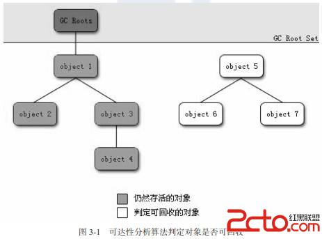

## 前言

垃圾回收器在进行垃圾回收之前，要做的第一件事情就是判断哪些对象还“活着”，那些对象已经“死去”（即不可能再被任何途经他使用的对象）。

判断对象是否存活，有两种比较流行的算法：

> * 引用计数算法
> * 可达性分析算法

## 引用计数算法

### 算法描述

给对象添加一个引用计数器，每当有一个地方引用它的时候，计数器的值就增加一；当引用失效的时候，计数器的值就减一；任何时刻计数器的值为0的就是不可能再被引用的。

### 算法特点

引用计数算法，实现简单，效率也比较高，在大多数情况下是一个比较好的算法。但是至少主流的java虚拟机里面没有选择使用引用计数算法来管理内存的，其中最主要的原因是**很难解决对象之间的循环引用的问题**。

简单的例子：
```
/**
 * testGC()方法执行后，objA和objB会不会被GC呢？ 
 * @author zzm
 */
public class ReferenceCountingGC {

	public Object instance = null;

	private static final int _1MB = 1024 * 1024;

	/**
	 * 这个成员属性的唯一意义就是占点内存，以便在能在GC日志中看清楚是否有回收过
	 */
	private byte[] bigSize = new byte[2 * _1MB];

	public static void testGC() {
		ReferenceCountingGC objA = new ReferenceCountingGC();
		ReferenceCountingGC objB = new ReferenceCountingGC();
		objA.instance = objB;
		objB.instance = objA;

		objA = null;
		objB = null;

		// 假设在这行发生GC，objA和objB是否能被回收？
		System.gc();
	}
}
```
上面的例子中，两个对象已经不能被访问了，但是他们之间相互引用者对方，导致他们的引用计数不为0，于是引用计数算法无法通知GC回收器回收他们。

## 可达性分析算法

### 算法描述

这个算法的基本思想就是通过一系列的称为“GC Roots”的对象作为起始点，从这些节点开始向下搜索，搜索所走过的路径称为引用链，当一个对象到GC Roots没有任何引用链相连接的时候，则证明对象是不可用的。



java语言中可作为GC Roots的对象包括下面几种：
> * 虚拟机栈（栈帧中的本地变量表中）引用的对象；
> * 方法区中类静态属性引用的对象；
> * 方法区中常量引用的对象；
> * 本地方法栈中JNI（及一般所说的Native方法）引用的对象；