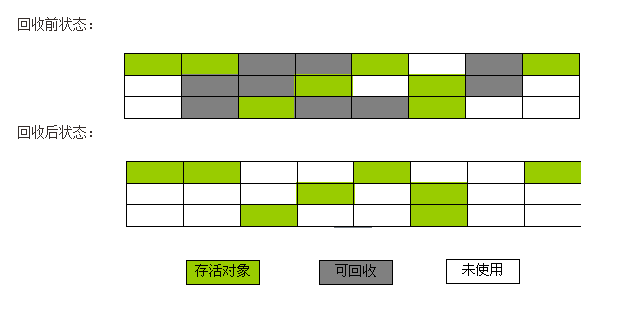
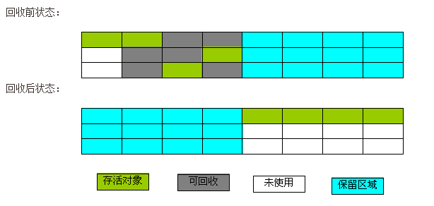
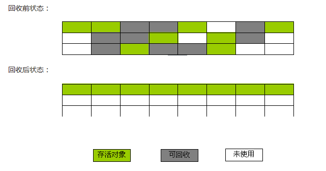

## 标记-清除算法

### 算法描述

**最基础**的收集算法，算法分为两个阶段：
> * 标记阶段
> * 清除阶段

首先标记被回收的对象，然后在标记完成后统一回收被标记的对象。
标记过程参考之前的博客[两次标记][1]

这个算法是最基本的算法，后续的算法都是基于这种思路，并对其不足进行改进得到的。

### 不足：

> * 效率问题 
标记跟清除两个过程的效率都不高；
> * 空间问题
标记清除之后，会产生大量的不连续的内存碎片，空间碎片太多，可能会导致之后分配较大的对象的时候，无法找到较大的连续的内存空间，而不得不提前触发另一次垃圾收集动作

算法的执行过程如下图所示：

## 复制算法

复制收集算法是为了解决标记清除算法的效率问题。

### 算法描述：

他将可用内存按容量划分成大小相等的两块，每次只使用其中的一块，当这一块的内存使用完了，就将还存活着的对象复制到另一块内存上，然后再把已使用的内存空间一次性的清理掉。

### 优点：
> * 这样每次都是对整个半区进行内存回收，运行高效；
> * 内存分配时，也不用考虑内存碎片等问题；
> * 内存非配时，只要移动堆顶部的指针，按顺序分配内存即可，实现简单。

### 缺点：
> * 可用内存为占用内存的一半，代价比较高。

复制算法的执行过程如下所示:

## 标记-整理算法

复制算法比较适合于新生代，在老年代中，对象存活率比较高，如果执行较多的复制操作，效率将会变低，所以老年代一般会选用其他算法，如标记—整理算法。该算法标记的过程与标记—清除算法中的标记过程一样，但对标记后出的垃圾对象的处理情况有所不同，它不是直接对可回收对象进行清理，而是让所有的对象都向一端移动，然后直接清理掉端边界以外的内存。

标记-整理算法的执行过程如下所示:

## 分代收集算法

当前商业虚拟机的垃圾收集都采用分代收集，它根据对象的存活周期的不同将内存划分为几块，一般是把Java堆分为新生代和老年代。在新生代中，每次垃圾收集时都会发现有大量对象死去，只有少量存活，因此可选用复制算法来完成收集，而老年代中因为对象存活率高、没有额外空间对它进行分配担保，就必须使用标记—清除算法或标记—整理算法来进行回收。

[1]: http://946898963.github.io/2016/05/31/%E4%B8%A4%E6%AC%A1%E6%A0%87%E8%AE%B0/